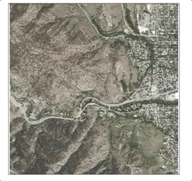
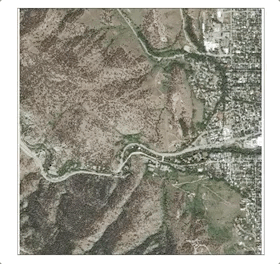

# 	react-native-image-with-progress-bar
| iOS  | Android | Description |
| ------------- | ------------- |------------- |
|   |   | Default progress bar |
| 
  |   | Progress bar with **barColor="red"** and **trackColor="black"**|
|    |    | If there is no Content-Length http header in the http response for the imageUrl, it switches from displaying a progress bar to displaying a spinner.|

A react-native image component that uses the content-length HTTP header to display a progress bar showing the 
progress of downloading an image from a http url. If there is no content-length HTTP header, 
It will switch from a progress bar to a spinner (because it cannot estimate the progress of the download) and send an error via the onLoadError callback prop while still attempting to download and display the image.

## Installing
`$ npm install react-native-image-with-progress-bar --save`

***then cd into the ios project directory and run pod install***

`$ cd ios`
`$ pod install`
___

## Usage example
 ```javascript
 import React, { useState } from 'react';
 import {
   SafeAreaView,
 } from 'react-native';
 import ImageWithProgressBar from 'react-native-image-with-progress-bar';
 
const App = () => {

  const anImageUrlToALargeImage = "https://wallpaperaccess.com/full/251618.jpg"

  return (
    <SafeAreaView style={{
      flex: 1,
      alignItems: 'center',
      justifyContent: 'center'
    }}>
      <ImageWithSpinner 
          mode="bar"
          barColor="red"
          trackColor="black"

          style={{ 
              width: 250, 
              height: 250,
              borderWidth: 0.5,
          }}
          
          imageUrl={anImageUrlToALargeImage}
          
          onLoadError={(error)=> {
            console.log("An error occured while loading the image");
            console.log(error);
          }}
    />        
    </SafeAreaView> 
  );
}
export default App;
 ```
___

## Props
| Name  | Type | Description |
| ------------- | ------------- |------------- |
| style  | object or array  |The same style prop that react-native's View component accepts   |
| trackColor  | string  |This prop is exactly as you'd define borderColor or backgroundColor in react-native. For example "rgb(70,130,180)" or "steelblue"|
| barColor  | string  |This prop is exactly as you'd define borderColor or backgroundColor in react-native. For example "rgb(70,130,180)" or "steelblue"|
| mode  | string ("bar" or "spinner")  |If the mode is "bar" it will display a progress bar unless the http response of the given imageUrl does not have a Content-Length header, in which case it will switch to displaying a spinner. If mode is "spinner" it will always display a spinner. The default mode is "bar"|
| imageUrl  | string  |The url with the image to load|
| onLoadError  | callback  |This is called with an object containing an error message describing the error that occured. Errors include serious ones like problems retreiving the body of the http request with the given imageUrl or problems decoding the data in the http response body into an image for which no image will be displayed. But an **error is also sent in the lesser case where there is no Content-Length header in the http response**. In the latter case, the image will still load (assuming the data can be decoded into an image)  |
**Pro tip**: You can specify a transparent barColor or trackColor like this: "rgba(70,130,180, 0.4)". 0.4 is the opacity or alpha value.
___

## Implementation Notes

#### How I set the layout
##### Android: 
I made an xml used the design view to set the layout. Then inflated the xml
##### iOS:
I set the layout in code because I could not find out what method is ran when the view resizes itself (layoutSubviews of UIView is not ran and there are no clues in RCTViewManager or RCTBridgeModule). So I set out the subviews and the auto layout constraints in code.


#### How I got the progress of the image download
##### Android: 
I used the method detailed in the stack overflow link in [1] to download the image in chunks and calculate the progress of the image download. However the code in [1] uses the now deprecated AsyncTask. I have read the up-to-date Android Documents on how to handle background tasks, not limited to [2], and have updated the code to use Futures, Executors and Handlers.
I have also improved upon the way in which the chunk size is chosen in [1].
###### On choosing the appropriate chunk size
One crucial detail pertaining to the way in which we get progress updates of the image download on android is the chunk size.

```java
      int maxAmountThatCanBeRead = inputStream.available();

                        int lengthOfByteArr;

                        if(maxAmountThatCanBeRead <=0){
                            //check if the content-length header is present
                            if(totalLength == -1){
                                lengthOfByteArr = 512;
                            } else {
                                lengthOfByteArr = totalLength;
                            }

                        } else {
                            lengthOfByteArr = maxAmountThatCanBeRead;
                        }
                        byte[] bytes = new byte[lengthOfByteArr];

                        int amountActuallyRead = inputStream.read(bytes);
                        //it may read less than the length/available or it might be -1
                        totalAlreadyRead += amountActuallyRead;
```
In the code above, I used `inputStream.available();` to ge the maximum that can be read from an input stream without blocking [6]. If it fails to return a value I set the chunk size to the size of the content length. I prefer using the max size of the file rather than some arbitrarily large number for the Len argument. The `inputStream.read();` method returns the number of bytes that were actually read anyway. If the content-length is not present, I use the arbitary value of 512 bytes.


##### iOS:
used the URLSession:downloadTask:didWriteData:totalBytesWritten:totalBytesExpectedToWrite: method to get the download progress which was far more straight forward


#### How i got the barColor and trackColor props working
I wanted it to behave like the borderColor property in react-native's style prop. So i looked into how react-native parses the style object for its Views. I ended up using the code iOS uses for the components shipped with react-native like View or Button.

##### Describing how iOS registers the components that ship with react-native
If we look into the Podfile in the ios directory of a react-native project (./ios/Podfile) we get:
```ruby
require_relative '../node_modules/react-native/scripts/react_native_pods'
require_relative '../node_modules/@react-native-community/cli-platform-ios/native_modules'

platform :ios, '10.0'

target 'loadingImageIos' do
  config = use_native_modules!

  use_react_native!(
    :path => config[:reactNativePath],
    # to enable hermes on iOS, change `false` to `true` and then install pods
    :hermes_enabled => false
  )
```
The first require_relative is to register the code that ships with react-native the second require_relative registers the code from all the third party libraries (I might make another post describing how it programatically adds pods for all the third party libraries using the info from react-native config later). The line `use_react_native`! runs the method defined in the first require_relative that registers the code that ships with react-native.

If we follow the code in the first require_relative, we learn that the code for Alert and Image lie in the directory `node_modules/react-native/Libraries`
(assuming the default path to the react-native executable was used, just a gotcha, unimportant for most circumstances). Reading the code in the directory, I ended up using the function exported by `./node_modules/react-native/Libraries/StyleSheet/processColor.js`to process the barColor and trackColor props.

The processColor function return a different output depending on the platform react-native is running on. I shall now describe how I used the output from the processColor function for each platform.

##### Android: 
On android the processColor function returns a 32 bit *signed* integer representing the color. Using the int in android to set the backgroundColor was quite straightforward because most arguments for color in android simply accept the int returned from processColor. There was the minor process of making a ColorStateList from the given int for which i used the StackOverflow link in [5] as well
##### iOS:
In iOS, the processColor function returns an a 32 bit *unsigned* integer representing the color instead. The process of using the output of the processColor function in iOS was a bit more involved as the I had to convert the int to a UIColor. I used all the links in [4] to write getUIColorForInt in PIRImageWithSpinnerManager.m. This includes the rgb and alpha value in UIColor.

#### How I fixed the border props issue on Android
##### Android only: 
On android when we make a custom UI component and pass in `style={{borderWidth: 1}}` a border does not get set. Similarly, the borderColor, borderRadius styles do not work as well. This problem only occurs on Android it works fine in iOS.

I tried digging into the Java code to figure out why it was happening. I learned that LayoutShadowNode’s setBorderWidths is 
being called and the border is being set in yoga. However the line `mYogaNode.setBorder(YogaEdge.fromInt(spacingType), borderWidth);` (line 943 of ReactShadowNodeImpl) does not seem to have any effect.
##### How I solved it:
```javascript
     <View
          style={styleToUse}
          >
              <NativeComponent 
                {...propsWithoutStyle}                

                barColorInt={barColorInt}
                trackColorInt={trackColorInt}    
                style={{
                  width: '100%',
                  height: '100%'
                }}
              />
          </View>
```

I simply wrapped the native component in a View and passed the `props.style` to the wrapping View. I got the idea for this from the official react-native guide for iOS Native UI components [7].

That is why when no style prop is passed in to the react-native-image-with-progress-bar component **on Android** it takes up the full width and height of its parent container. I left it like this because I feared that validating the style prop myself will bring about more problems and unaccounted for edge cases. 

(FYI: on iOS if no style prop is passed the component will not be rendered. This same thing occurs with react-native's Image component).

#### Miscellaneous
* Written in **Java** and **Objective-C**

* Has no third party libraries like Glide or AFNetworking because I wanted to challenge myself

* For android I made the spinner a fixed height because I notice that in iOS the ActivityIndicator is a fixed height as well (not proportional to the screen) and I approximated its dimensions and set it to equal for Android

* It throws a Redbox error if the mode prop is not “bar” or “spinner”, might seem extreme but I did it because I thought looks cool. On android I still haven’t figured out how to remove the “null” in the Redbox screen. Ive tried throwing all kinds of errors from react-native and Java.

* I used create-react-native-library to create the boiler plate

* I made the iOS version take the default colors of the ProgressBar component on Android. I used Digital Color Meter on Mac to get the rgb values.
___

## References
1. [A Stackoverflow that thought me how to download an image in Android in chunks (so we can get the progress)](https://stackoverflow.com/questions/38940382/downloading-image-via-asynctask-and-displaying-it-in-an-imageview-without-storin)
2. [I used the official Android guides to update the code in the SO link above as AsyncTask has been deprecated](https://developer.android.com/guide/background/threading)

3. [The Stanford iOS objective-C Lecture series which forms the basis of my understanding of iOS development](https://www.youtube.com/channel/UCxYl0ECy6PM11VzsW943cQA/featured)

4. I used the Stack Overflow links below to figure out how to convert  unsigned 32 bit integers to UIColor [Link1](https://stackoverflow.com/questions/19405228/how-to-i-properly-set-uicolor-from-int) | [Link2](https://stackoverflow.com/questions/28644311/how-to-get-the-rgb-code-int-from-an-uicolor-in-swift)| [Link3](https://stackoverflow.com/questions/38670418/how-to-convert-a-uicolor-to-uint32-i-get-the-error-ambiguous-use-of-operator)

5. [How to create ColorStateList programatically](https://stackoverflow.com/questions/15543186/how-do-i-create-colorstatelist-programmatically)

6. [Android API docs on Input Stream](https://developer.android.com/reference/java/io/InputStream#available())

7. [The react-native ios Native UI Components guide gave me the idea to wrap the Android component in a View](https://reactnative.dev/docs/native-components-ios#styles)


